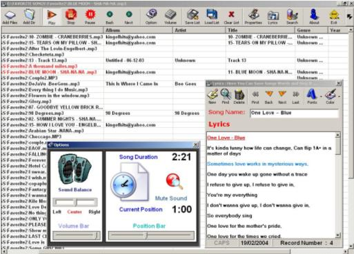



## Cool Mp3 Player2004

### Description

not just a player

mp3 player with many and many feauters and Functions like:

1-add mp3 files with multi select

2-add directory

3-Player commands : play,stop,pause,next,prev

4-options with position bar + volume bar + change sound source to left or right side

5-load mp3 files info like (Album ,Artist ,Genre, Title, Year, Comment

6-save songs list

7-load songs list

8-clear list

9-Mp3 file properties to change mp3 file info

10-search for mp3 files in your computer and get them all

11-Songs Lyrics: here you can save songs Lyrice and all what you want

----

12-Please Vote
 
### More Info
 

             |
---                |---
**Submitted On**   |2004-02-21 11:36:06
**By**             |[Ali Ghanem](https://github.com/Planet-Source-Code/PSCIndex/blob/master/ByAuthor/ali-ghanem.md)
**Level**          |Advanced
**User Rating**    |4.5 (45 globes from 10 users)
**Compatibility**  |VB 5\.0, VB 6\.0
**Category**       |[Complete Applications](https://github.com/Planet-Source-Code/PSCIndex/blob/master/ByCategory/complete-applications__1-27.md)
**World**          |[Visual Basic](https://github.com/Planet-Source-Code/PSCIndex/blob/master/ByWorld/visual-basic.md)
**Archive File**   |[Cool\_Mp3\_P171525322004\.zip](https://github.com/Planet-Source-Code/ali-ghanem-cool-mp3-player2004__1-52100/archive/master.zip)

